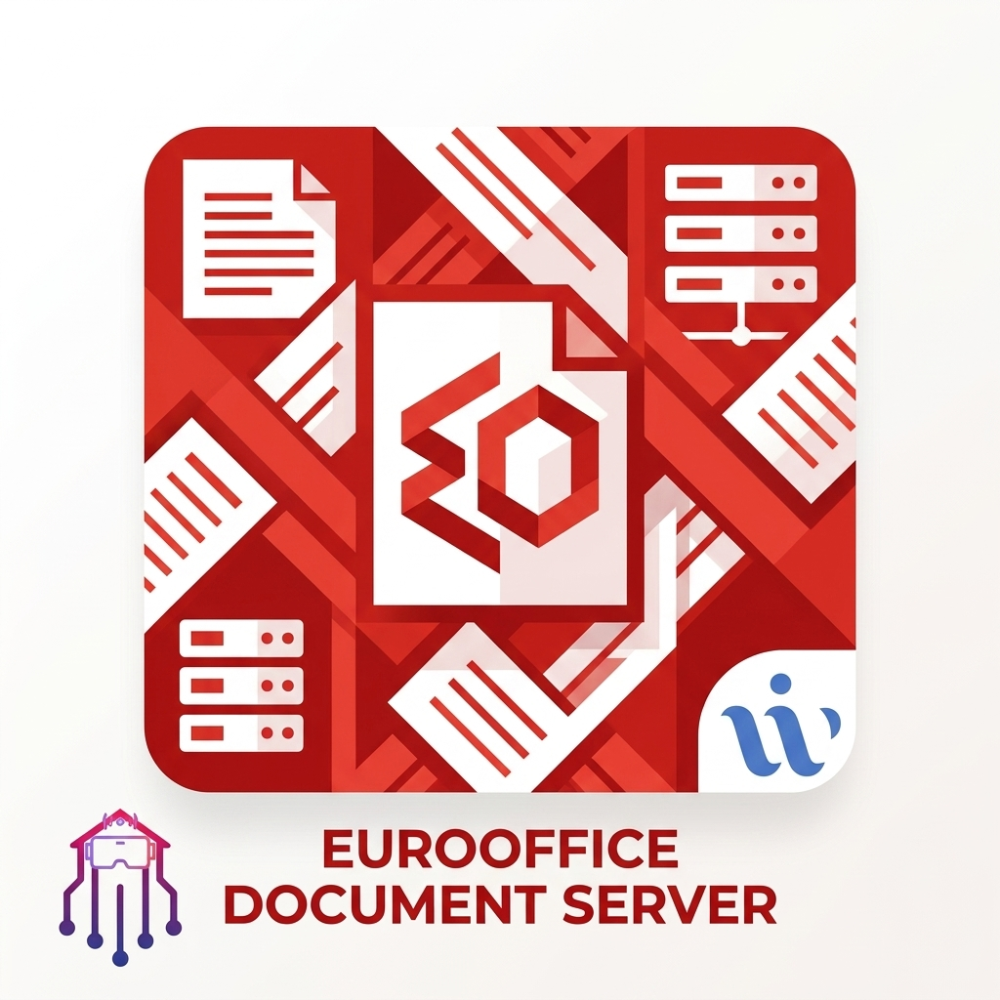

# Branding & Credits

    

        
        
    

    

        <strong>Alfonso Vertucci | Working With Web</strong> 
        <a href=\"https://virtualgate.workingwithweb.eu/\">Virtual Gate Project</a> | 
        <a href=\"https://workingwithweb.it/webagency/gestisci-wordpress-da-chatgpt-wp-gpt-automation-pro/\">WP GPT Automation Pro</a>
    

# EuroOffice Document Server

Collaborative ONLYOFFICE-based document server for Home Assistant.

## Features
- Fully compatible with ONLYOFFICE Document Server formats.
- Pre-installed collaborative editing server.
- Automatic JWT security token synchronization with Home Assistant.

## What we added to the standard container:
- **Smart Entrypoint**: A custom `run.sh` script that reads your Home Assistant add-on options and automatically configures JWT for both the Document Server and the Example App.
- **Port Mapping**: Simplified port exposure for Document Server (8080) and Example App (3000).
- **Automated Build**: CI/CD pipeline on GitHub for fast, optimized deployment on amd64 architectures.

## Configuration & Integration
To use EuroOffice with Nextcloud:
1. Ensure `jwt_enabled` is set to `true`.
2. Use the same `jwt_secret` in both EuroOffice and Nextcloud add-ons.
3. In Nextcloud settings, use the URL `http://<your-ha-ip>:8080` or the internal container hostname.

## Troubleshooting
- **Security Token Error**: Ensure the `jwt_secret` matches perfectly between the Document Server and the client (Nextcloud).
- **Port Busy**: If the add-on fails to start with "address already in use", check if another add-on or a manual docker container is using port 8080.
- **Logs**: Check the logs for `[EuroOffice] Document Server JWT configured` to confirm the setup script ran successfully.

## Official Documentation
- [ONLYOFFICE API Documentation](https://api.onlyoffice.com/editors/basic)
- [ONLYOFFICE Document Server GitHub](https://github.com/ONLYOFFICE/DocumentServer)

## Credits
This project is maintained and optimized by **Alfonso Vertucci** of **Working With Web**.
Website: [workingwithweb.it/webagency](https://workingwithweb.it/webagency)

